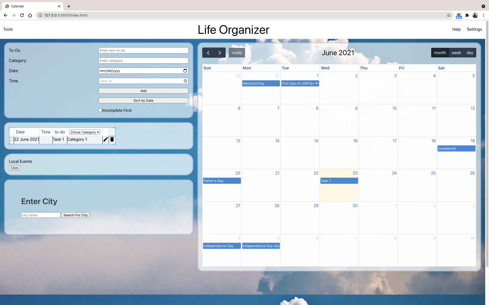
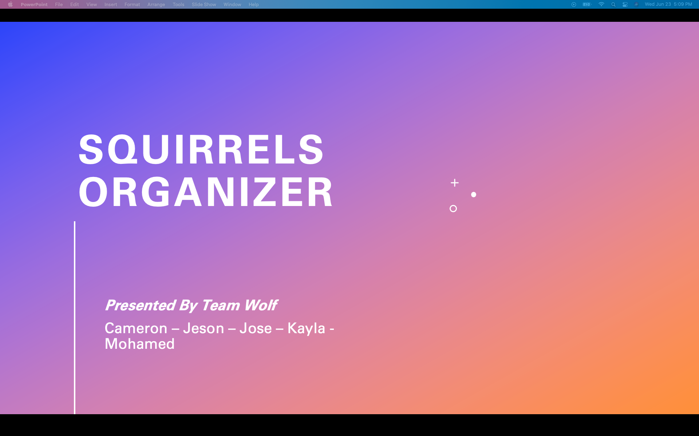
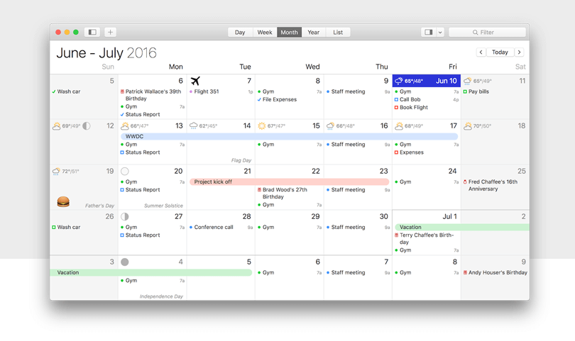

# Calendar Squirrels-Life-Organizer
Plan A Happy Life; Squirrels Planner helps you stay inspired & on track; Take advantage of monthly & weekly calendar views for high performance productivity; Includes weather forcast & Seattle local events to keep you a happy planner.

## Description
This project aims to provide an easier way to track tasks and local events for 2 main reasons:-
Most calendar apps are not very optimized and take awhile to create events and reminders which can be very challenging for a lot neurodivergent patients.
As well as neurotypical people can benefit from a centralized location in which their life can be organized.

## Features
- Local events and event creator
- Weather
- US Hoylidays
- Useful resources

## Table of Contents (Optional)
If your README is long, add a table of contents to make it easy for users to find what they need.
- [Project Presentation]()
- [Project Live Page]()
- User Stories
- Challanges
- [Credits](#credits)

## Installation
 The APLLICATION can be used right away by navigating through the provided link or downloading the source directly.

## User Stories
- As an after-school athlete I want  to see local soccer events, so that I don’t feel sick during practice.
- As the parent of  ADHD children, I am looking for an app  with To-Do list so I can help them out to organize their daily life activities.
- As a Travel Nurse and mother of I want to give him options for local events wherever we travel , so I can keep my child from being bored at home while I’m at work.
- As a daycare provider I want to find easy to set up a weekly schedule, so I can stay up to date on my tasks for my business.
- As the parent of  ADHD children, I am looking for an app  with To-Do list so I can help them out to organize their daily life activities.

## Secreen shots
Welcome Page with useful resources

Main Application responsive page

Our Presentation

Website general Wireframe

## Credits
Mohamed Mesahel
cameron-907
KaylaMorris11
jose diaz01
JMagic-Learner

**Coded with:**
   *HTML
   *CSS
   *Javascript
   *jQuery 

**APIs Integrated:**
   *PredictHQ’s
   *Google Calendar
   *AccuWeather

**Additional Libraries/Frameworks:**
   *Bulma
   *Moment.js
   *JQuery.